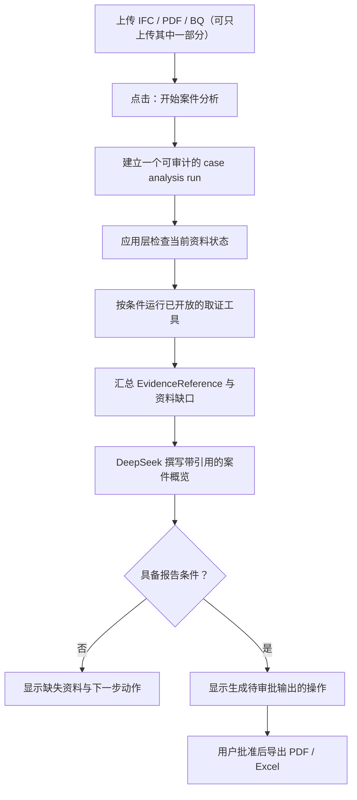

# VO Copilot 第 3 级：案件概览工作流设计规格

**日期：** 2026-05-27
**基础提交：** `9e64ac3` (`codex/v2codex-evidence-brain`)
**后续分支：** `codex/v2codex-case-workflow`

## 目标

第 3 级把 VO Copilot 从“可以可靠回答问题”推进到“可以在用户授权后整理一个案件”。用户上传 IFC、PDF/扫描件或 BQ 后，点击一次“开始案件分析”，系统生成一份证据绑定的案件概览包，说明已有资料、已发现变更、商业判断所处状态、缺失资料和下一步动作。

本级以可控主动性为原则：

- 未点击按钮时，不自动启动案件分析，也不触发分析计费回合。
- 系统可以主动整理与提醒，但不能绕过证据和审批边界。
- 每项关键案件事实必须引用第 2 级产生的结构化证据。
- 没有核验的 BQ 映射与费率时，不能形成正式金额结论。
- 正式 PDF/Excel 输出继续需要用户审批。

## 采用的方案

采用**用户触发、确定性编排、模型撰写**的案件概览工作流。

不采用“模型自由决定要运行哪些工具”的自动代理方式作为工作流核心。因为 IFC、PDF 与 BQ 的可用状态可以由应用程序明确检查，关键工具运行顺序也可以被控制；由确定性编排收集证据，再让模型根据已经收集的证据写概览，更容易测试、审计和阻止越界结论。

也不在本轮建设完整的案件管理看板或法规知识库。这些都可以在案件概览稳定后接入，而不应阻塞第一条可用工作流。

## 用户工作流



### 启动行为

- Copilot 区域增加主命令按钮 `开始案件分析`。
- 按钮在没有任何 IFC、PDF/扫描件或 BQ 时禁用，并提示先上传资料。
- 点击后创建一次案件分析 run；正在分析期间按钮切换为运行状态，现有停止生成能力仍可终止模型撰写阶段。
- 按钮只由用户触发；上传动作本身不启动 run。

### 输出内容

案件概览包按固定部分显示：

1. **资料状态**：Base IFC、Revision IFC、PDF/扫描件、Awarded BQ 是否存在，以及当前可用于判断的范围。
2. **已确认事项**：来自 IFC 查询/比较、OCR 页码摘录或 BQ 映射的事实，每项附引用。
3. **变更与商业状态**：有 IFC comparison 时显示增删改摘要；只有具备已核验 BQ 证据时才显示金额状态。
4. **资料缺口与风险**：例如缺少 Revision IFC、缺少 BQ、OCR 有截断或 BQ 尚未映射。
5. **下一步动作**：明确列出用户可以采取的补件、映射、复核或发起审批动作。

当证据不足时，概览包仍然有价值：它应明确指出无法判断的内容，而不是生成空泛报告。

## 架构

### 工作流编排器

新增一个专门的案件分析编排层，例如 `src/agent/case-workflow.ts`。它不直接生成自然语言结论，而是根据 `ToolContext` 建立结构化输入和运行步骤：

```ts
interface CaseAnalysisReadiness {
  hasAnySource: boolean;
  hasBaseIfc: boolean;
  hasRevisionIfc: boolean;
  canCompareIfc: boolean;
  hasDocument: boolean;
  hasBq: boolean;
  canValue: boolean;
  canOfferFormalOutput: boolean;
}

interface CaseOverviewPacket {
  readiness: CaseAnalysisReadiness;
  completedSteps: string[];
  evidenceRefs: EvidenceReference[];
  missingInputs: Array<{
    code: string;
    label: string;
    reason: string;
    blocks: 'comparison' | 'valuation' | 'report';
  }>;
  valuationStatus: 'not_available' | 'pending_verified_bq' | 'supported_by_bq';
  recommendedActions: string[];
}
```

`canValue` 只有在已产生 IFC comparison 且至少存在一项由用户上传、成功映射并已核验的 BQ rate evidence 时才为真。`canOfferFormalOutput` 只有在 `canValue` 为真、案件概览已成功生成且现有审批功能可用时才为真。

编排器的工具调用规则固定如下：

| 条件 | 工具动作 | 允许产生的内容 |
| --- | --- | --- |
| Base 或 Revision IFC 已加载 | `audit_ifc`，针对可用槽位 | 文件可读性、数量提取摘要与 audit 证据 |
| Base 与 Revision IFC 均加载 | `compare_ifc` | 技术变更摘要与 comparison 证据 |
| PDF/扫描件已上传 | `ocr_document` | 页码证据、摘录范围与 OCR 限制 |
| 已完成比较且存在用户 BQ 映射 | `summarize_commercial_impact` | 只有匹配成功的 BQ rate evidence 可支撑金额状态 |

编排器不会调用仍被关闭的法规、合同判断或估价数据库工具，也不会自动运行正式输出工具。

### 模型综合阶段

编排完成后，客户端向现有服务端控制的 `agent-proxy` 发起一个案件概览综合请求。请求只携带：

- 固定的用户意图标识，例如 `case_overview`；
- 结构化 `CaseOverviewPacket`；
- 当前 run 的已注册 evidence references；
- 已有的结构化 workspace 状态。

服务端继续控制模型、系统规则与工具 allowlist，并增加案件概览规则：

- 概览只能陈述 packet 与 evidence references 已支持的事实。
- “已确认事项”和“商业状态”中的事实必须引用已提供编号。
- 对缺失资料只陈述缺失及影响，不推断不存在的工程事实。
- 未满足 `supported_by_bq` 时，不得呈现正式估值或建议认证金额。
- 模型不负责选择正式导出；它只能说明是否已达到可以请求审批的条件。

### 运行记录与持久化

复用已存在的 `agent_runs`、`agent_steps`、`agent_evidence` 与 `agent_approvals`：

- run 在现有 JSON 输入/元数据中记录 `workflow: 'case_analysis'`，不为此新增独立 run 表字段。
- 每个确定性步骤作为 tool step 被记录，沿用已有 evidence payload。
- 增加 `case_overview` evidence 类型，用于保存最终结构化概览 packet 与其引用集合。
- 最终自然语言文本仍保存为 assistant step 输出，并记录其有效/无效引用。
- 不读取或写入自动长期 memory。

数据库变更只扩展 evidence type 的约束值，不放松 RLS，也不修改旧记录。

## 界面设计

### 初始状态

现有欢迎和上传提示保持不变。在资料区与输入区域附近提供一个明确的命令：

- `开始案件分析`
- 无资料时禁用。
- 有任意一类资料时可点击。
- 分析运行时显示 `正在整理案件...`，并保留停止操作。

### 概览呈现

一次成功分析后，在对话区域显示一个紧凑的案件概览结果，而不是营销式仪表板：

- 顶部状态行：`案件概览`、生成时间、资料覆盖状态。
- 分段内容：资料状态、已确认事项、缺失资料、下一步动作。
- 已确认事项沿用第 2 级的可展开依据显示。
- 缺失资料以工作项行显示，标明会阻塞 `比较`、`估值` 或 `报告` 中的哪一步。
- 只有 `canOfferFormalOutput` 为真时才显示现有的审批后导出入口；否则仅显示如何补足条件。

不恢复被移除的角色切换、主动建议列表或自动对话注入。用户看到的是一个受控流程结果，不是一个自行扩张权限的代理。

## 条件判断与安全边界

### 资料与输出条件

| 状态 | 允许输出 |
| --- | --- |
| 仅有单个 IFC | 可做 audit 与资料范围说明，不声称变更 |
| Base + Revision IFC | 可陈述技术变更，并引用 comparison evidence |
| 仅有 PDF/扫描件 | 可提取页码依据和文档中出现的文字，不声称模型变更 |
| IFC comparison + 未核验 BQ | 可说明变更，金额保持待核验 |
| IFC comparison + 已映射且核验 BQ | 可生成 BQ 支撑的商业状态并提供审批入口 |

### 失败与中止

- 单一取证步骤失败时，概览仍可生成，但必须把该资料标为读取失败或未纳入结论。
- OCR 被截断、置信度不足或页面未处理完整时，packet 保留 limitation，概览中必须显式显示。
- 用户停止综合回复时，run 记录为 cancelled；已完成工具证据仍可留存供用户重新启动分析时使用，但不得自动组成正式输出。
- 服务端拒绝请求或计费失败时，不产生假概览，界面显示失败原因和可重试动作。

## 预计修改边界

- `src/agent/case-workflow.ts`：新建确定性案件分析编排器、readiness/packet 类型和缺件判断。
- `src/agent/case-workflow.test.ts`：覆盖资料组合、步骤路由、估值条件与失败降级。
- `src/agent/agent-client.ts`：支持案件概览综合请求、run metadata 与最终 overview 事件。
- `src/agent/agent-client.test.ts`：验证综合请求只使用收集到的证据和停止/失败行为。
- `src/components/CopilotPanel.tsx`：增加按钮、运行状态和案件概览显示。
- `src/App.tsx` 与 `src/pages/ProjectWorkspace.tsx`：向面板提供触发所需状态，不改变文件加载逻辑。
- `supabase/functions/agent-proxy/policy.ts`：增加 `case_overview` 综合规则。
- `supabase/functions/agent-ledger/index.ts` 与 migration：允许 `case_overview` 证据类型；workflow 标识写入现有 run JSON 元数据，不需要新增数据库列。

第 3 级不需要修改 IFC 解析核心、OCR 引擎核心或报告生成器内容；它只消费第 2 级已经产生的证据与已批准输出能力。

## 测试与验收

### 自动化测试

- 无资料时，案件分析按钮不可启动流程。
- 只有 Base IFC 时，仅运行 audit；packet 标记缺 Revision IFC 且不生成比较事实。
- 两份 IFC 时运行 compare，并产出带 `[CMP-*]` 的已确认事项。
- 有 PDF 时运行 OCR，并把页码引用与 limitation 带入 packet。
- 有比较但无核验 BQ 时，`valuationStatus` 不得进入可估值状态。
- 有比较与核验 BQ 时，packet 可标记具备商业依据和审批入口条件。
- 单步工具失败时，概览标识该缺口，不捏造该步骤结果。
- 综合答案漏引或虚构引用时，沿用第 2 级警告和拒绝正式输出机制。
- 未点击按钮时，不产生案件分析 run 或额外代理请求。

### 浏览器验收

- 上传资料后出现可点击的 `开始案件分析`；未上传时保持禁用。
- 点击后显示明确进度，不暴露原始工具 JSON 或模型中间推理。
- 只有不完整资料时，结果清楚显示缺件与被阻塞的步骤。
- 有 IFC/PDF/BQ 组合资料时，概览显示可展开证据和正确的金额边界。
- 停止生成仍有效；只有满足条件且用户审批后才能导出正式 PDF/Excel。

### 部署验收

- 应用 migration 后部署 `agent-ledger` 与 `agent-proxy`。
- 用 owner 测试账号核验按钮触发、证据记录、审批输出与测试计费标记。
- 用非 owner 账号验证分析请求仍按正常 credit 规则计费。

## 非目标

本轮不包含：

- 自动监听上传并自行开始分析；
- 马来西亚法规、合同条款或标准计量规则知识库；
- 跨项目长期记忆或自学习；
- 邮件/通知/任务分派；
- 自动审批、自动导出或自动提交正式 VO 文件；
- 完整项目管理看板。

## 风险与控制

| 风险 | 控制方式 |
| --- | --- |
| 工作流过度主动，造成误收费或误结论 | 只有用户点击后启动，且记录 run |
| 模型跳过缺件直接给结论 | readiness 和 packet 由确定性编排产生，policy 限制综合文本 |
| BQ 不完整却产生正式金额 | `valuationStatus` 与输出入口以核验 BQ evidence 为硬条件 |
| 某一工具失败导致整份结果不可用 | 允许降级概览，但显示失败与影响范围 |
| 第 3 级破坏前两级安全边界 | 复用已有 tool allowlist、引用校验、审批输出和服务端 policy |

## 完成定义

第 3 级第一轮完成时，用户可以在项目页面上传已有资料后，主动点击一次按钮，获得一份来源可查、缺口清楚、金额边界可靠的 VO 案件概览；当材料足够时，系统可以引导进入既有的审批输出流程，但不能自行替用户作出正式判断或导出文件。
